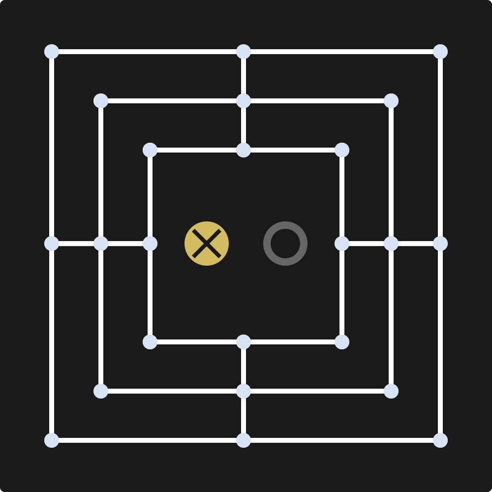

# NineMansMorris

Board game turned Video Game

## How To Build

`clang++ game.cpp Button.h Button.cpp -lraylib -lGL -lm -lpthread -ldl -lrt -lX11`

## Game

## How To Play

- Place **pieces** alternating players until each player has placed 9 pieces.
- If a player has placed **3** pieces in a row or col, they must remove one of the opponents pieces. This is known as a **Mill**.
- Once each player has placed 9 pieces, they must move pieces to an **adjacent open space**.
- If a player has 3 pieces left, that player can move there remaining pieces to anywhere on the board. This is known as **Flying**.
- The Game will end once a player's pieces has been reduced to **2**.
